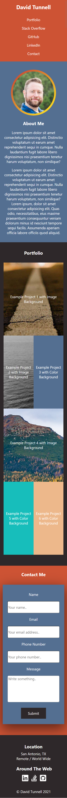

# My Web Portfolio

This portfolio is now upgraded to have a [Node.js](https://nodejs.org/en/)/[Express.js](https://expressjs.com/) server to serve the index.html and to have an API call that allows for emails to be sent via the form via gmail servers using [Nodemailer](https://nodemailer.com/about/). It started with just HTML/CSS with no outside library other than utilizing some Font Awesome icons for footer navigation. There are various hover animations for the nav bar, portfolio flex boxes, contact submission button and around the web footer links. Media queries were used so it will be responsive on mobile devices.

It can be viewed live here: https://david-tunnell-web-portfolio-v1.herokuapp.com/

## Desktop Screenshot

## Mobile Screenshot

